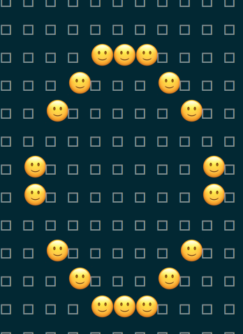
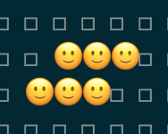
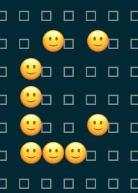
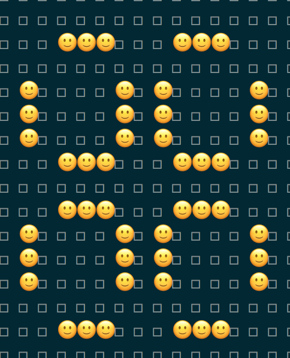
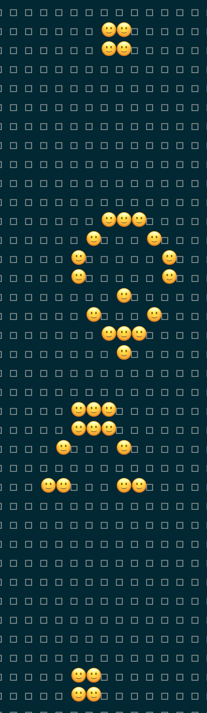

# Game of Life

There are 7 different simulations:

```
1. RandomRatio50  //alive ratio at beginning 50%
2. RandomRatio10  //alive ratio at beginning 10%
3. Pentadecathlon
4. Toad
5. LightweightSpaceship
6. Pulsar
7. GospersGliderGun
```

to run the simulation type `bin/run`

### Demo

**Pentadecathlon**



**Toad**



**LightweightSpaceship**



**Pulsar**



**GospersGliderGun**




Code adapted from <https://github.com/renuo/game-of-life>